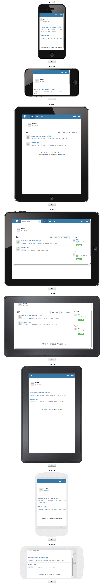

responsive-tool
===============

###说明:
其实就是一个本地测试响应式的工具。可以点击每个设备下面的按钮实时刷新。

里面只写了几个常见的设备,因为有时候要调试iphone,ipad等设备的响应式布局,用浏览器插件或者直接拉伸都觉得有点不方便，就扒了一个这样的工具。

###使用：
把ifram里面的链接换成自己要测试的链接就可以了.

DEMO: http://blog.yongyuan.us/responsive-tool/

